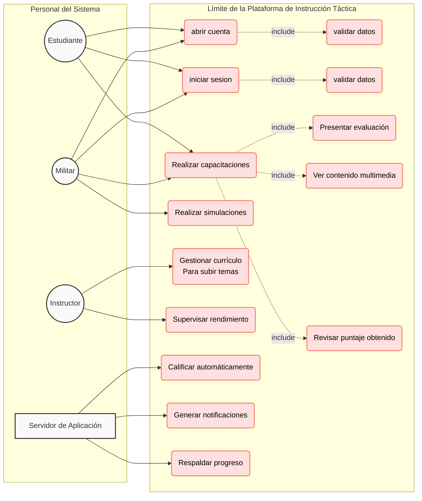
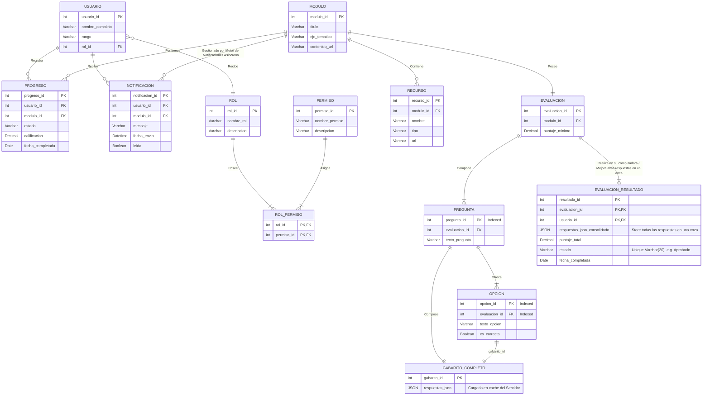
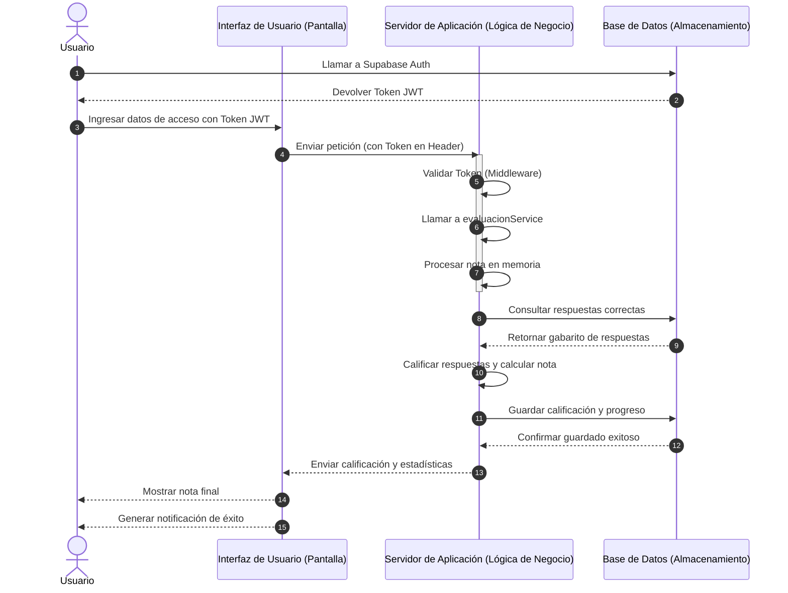

### 📖 Documentación Técnica Autogenerada
Para generar y visualizar el sitio web estático con la documentación técnica de las funciones del sistema, ejecute localmente:
```npm run doc``` o ```bun run doc```
# Plataforma de Capacitación Integral y Control de Estudios de Cadetes

Aplicación web automatizada y protegida diseñada para la gestión del plan de estudios y el progreso de conocimientos militares.

## 1. Paridad de Entornos
Las variables de entorno necesarias para levantar el proyecto de forma local se detallan en el archivo `.env.example`.

---

## 2. Arquitectura del Sistema (Doc-as-Code)

```mermaid
graph TD
    classDef frontend fill:#ffffff,stroke:#ffd54f,stroke-width:2px,color:#000000;
    classDef core fill:#f1f8e9,stroke:#558b2f,stroke-width:2px,color:#000000;
    classDef supabase fill:#eceff1,stroke:#37474f,stroke-width:2px,color:#000000;
    classDef db fill:#ffffff,stroke:#1565c0,stroke-width:2px,color:#000000;

    subgraph STACK_CLIENTE [STACK CLIENTE: React 18 / Vite / TypeScript / Tailwind CSS / shadcn/ui / React Router v6]
        A[INTERFAZ DE USUARIO INTERACTIVA<br>Desarrollada con herramientas modernas para navegación intuitiva]
    end
    class STACK_CLIENTE,A frontend;

    subgraph CAPA_APLICACION [CAPA DE APLICACIÓN (LÓGICA DE NEGOCIO)]
        subgraph CORE [CAPA DE SERVICIOS DE LÓGICA DE NEGOCIO (INTERNAL CORE)]
            subgraph COMPONENTES [COMPONENTES DE SERVICIO MODULAR / LÓGICA DE NEGOCIO PRINCIPAL]
                B1[GESTOR DE EVALUACIONES<br>Cálculo de Notas y Gestión de Preguntas in-memory]
                B2[MOTOR DE NOTIFICACIONES<br>Emisión de Alertas y Actualizaciones Asíncronas]
            end
        end
    end
    class CAPA_APLICACION,CORE,COMPONENTES,B1,B2 core;

    subgraph CAPA_DATOS [CAPA DE DATOS (BACKEND)]
        subgraph BAAS [SERVICIOS DE DATOS BaaS INTEGRADOS (Supabase)]
            C[AUTENTICACIÓN Y AUTORIZACIÓN<br>(Supabase Auth)]
        end
    end
    class CAPA_DATOS,BAAS,C supabase;

    subgraph CAPA_ALMACENAMIENTO [CAPA DE ALMACENAMIENTO]
        D[(BASE DE DATOS RELACIONAL<br>(Supabase PostgreSQL))]
    end
    class CAPA_ALMACENAMIENTO,D db;

    A <--> |Internal Service Endpoints| CORE
    A <--> |Salida del API Gateway: con JWT token| BAAS
    A --> |JWT Issuing| BAAS
    CORE --> BAAS
    BAAS <--> D
```








📌 **Bitácora del Proyecto:** El historial detallado de tareas y el cumplimiento de la *Definition of Done (DoD)* se encuentran documentados de forma independiente en el archivo [CHANGELOG.md](./CHANGELOG.md).
