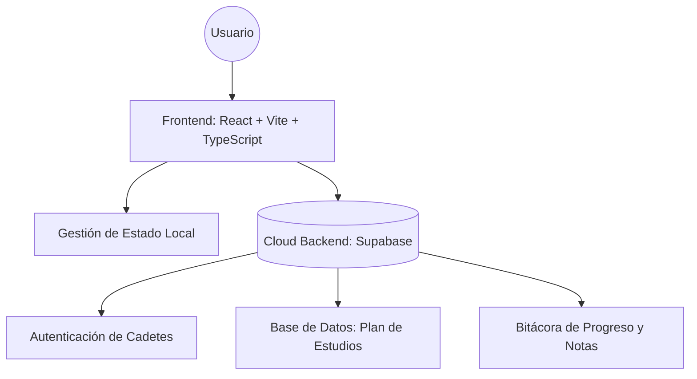
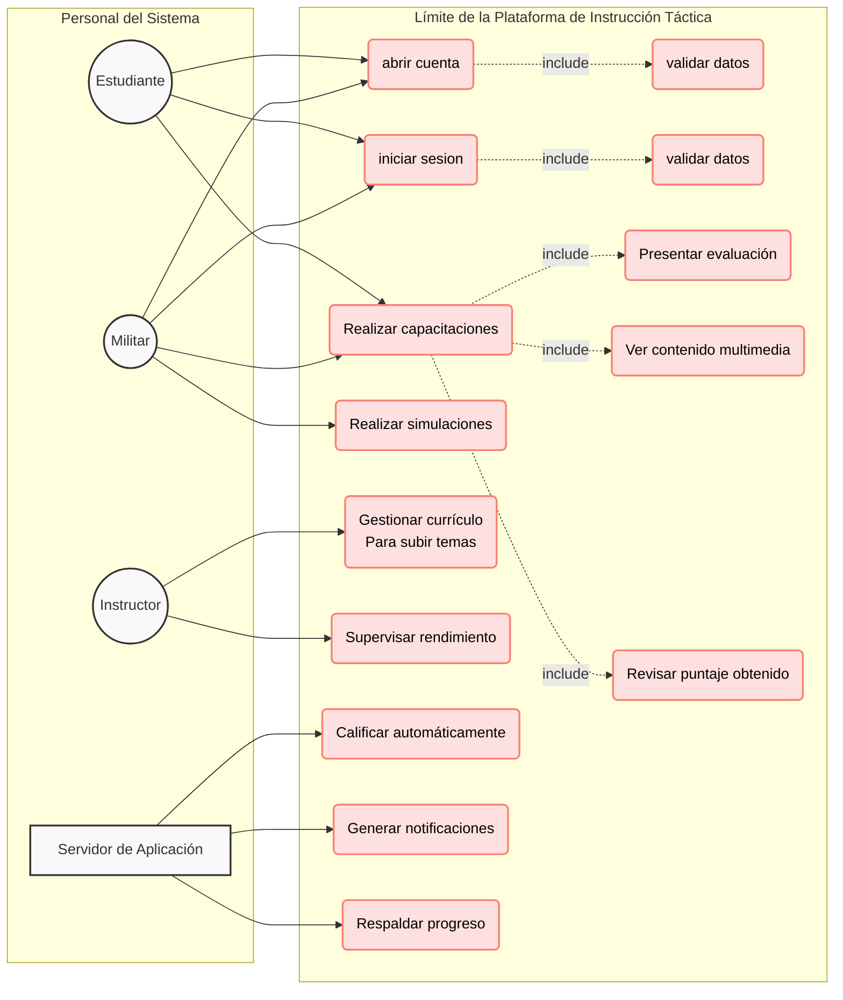
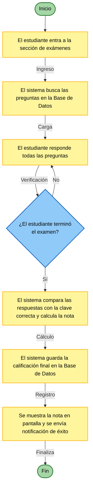
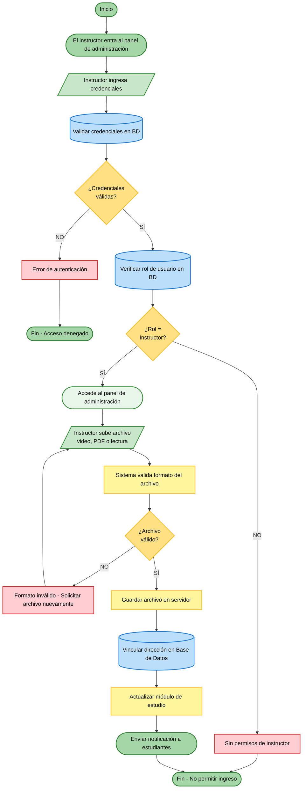
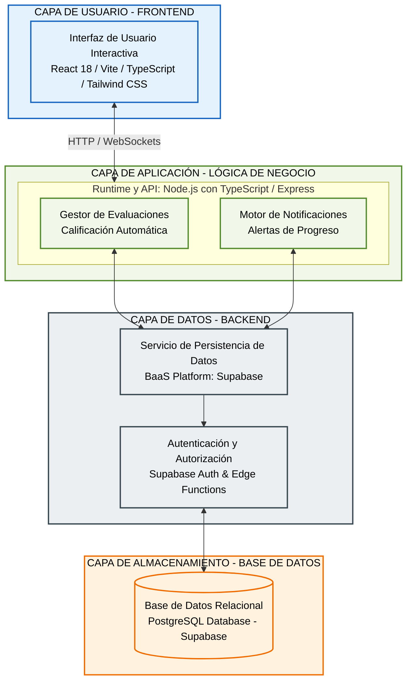
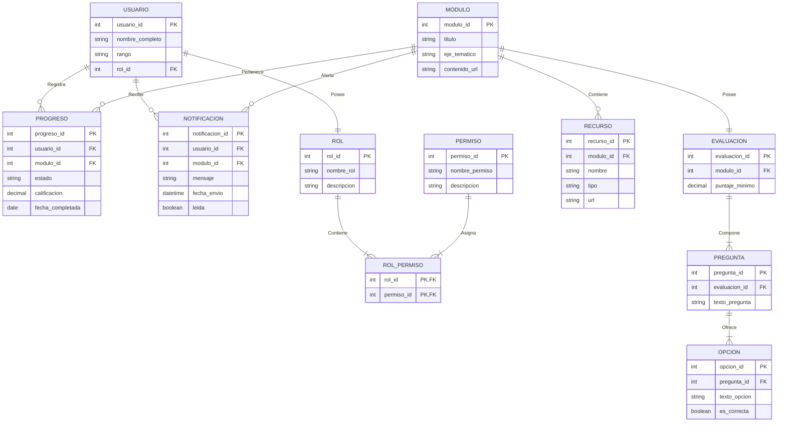
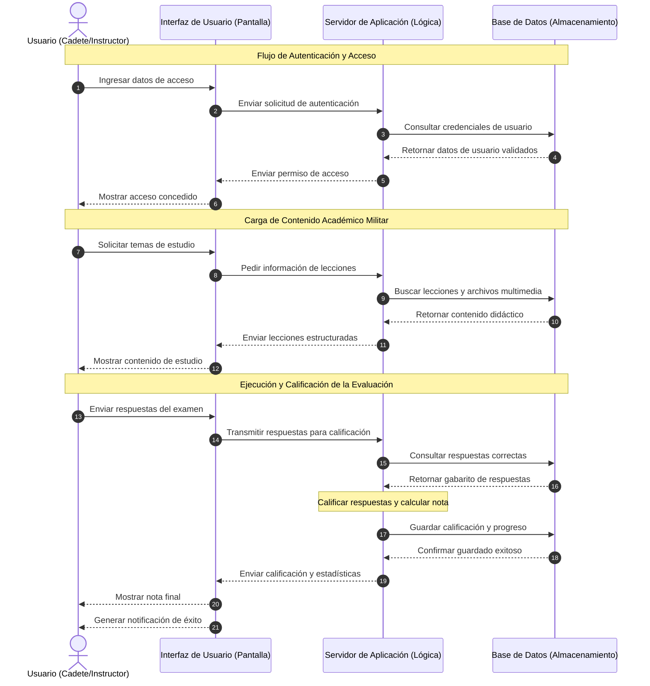

# Plataforma de Capacitación Integral y Control de Estudios de Cadetes

Aplicación web automatizada y protegida diseñada para la gestión del plan de estudios y el progreso de conocimientos militares.

## 1. Paridad de Entornos
Las variables de entorno necesarias para levantar el proyecto de forma local se detallan en el archivo `.env.example`.

---

## 2. Arquitectura del Sistema (Doc-as-Code)















```


```
